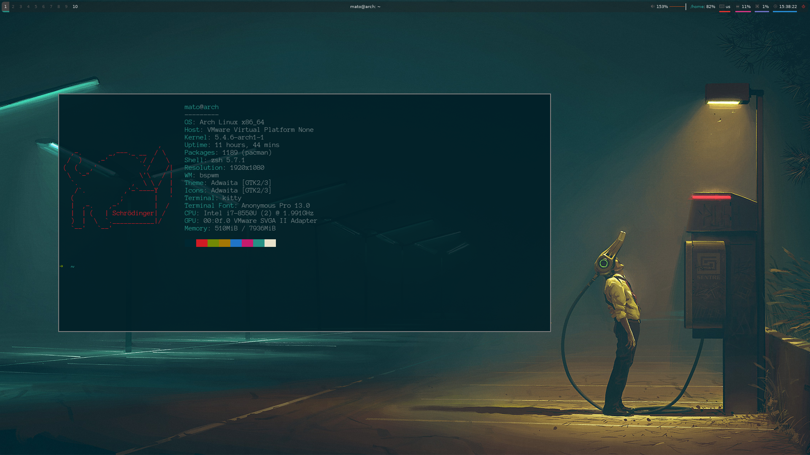

# dotfiles
my dotfiles for a general development setup for UNIX systems. This workflow features completely modular setup that promotes a keyboard/shortcut focused workflow to maximize ergonomics and productivity.

# Sections
- [Terminal](#terminal)
    - [kitty](#kitty)
    - [zsh](#zsh)
- [Tools](#tools)
    - [vim](#vim)
    - [emacs](#emacs)
- [System](#system)
    - [bspwm](#bspwm)
    - [sxhkd](#sxhkd)
- [Aesthetics](#aesthetics)
    - [Fonts](#Fonts)
    - [Colorschemes](#Colorschemes)

# Terminal
## kitty
kitty is a fast and modern terminal emulator that comes with many useful features that you would not expect from a terminal emulator. It handles graphics, unicode, and emojis beautifully. It also offers built-in terminal tiling, tabs, and windows. This essentially rids the need of tmux and other third party tiling managers. There are also much more advanced features I have not discussed. To learn more about kitty, visit their [home page](https://sw.kovidgoyal.net/kitty/).
## zsh
zsh is an extends on bash and offers many improvements along with a big community behind it. The shell offers many plugins that allows more informative prompts, better tab completion, live syntax highlighting and more. As for my configuration, I simply extended on the community driven configuration file, [ohmyzsh](https://github.com/ohmyzsh/ohmyzsh).
# Tools
## vim
vim is a fast and highly extensible text editor with a vibrant community behind it. vim controls focuses and ergonomics and productivity. I have a separate repository for my [vim configuration](https://github.com/MatoPlus/vimrc).
## emacs
emacs is an highly extensible text editor that allows users to customize the ecosystem that is emacs in it's native language, emacs-lisp. emacs is slow but it does most things that vim have troubles with (tagging in large code bases). It is generally a good idea to use [spacemacs](https://github.com/syl20bnr/spacemacs) when starting out, but we all eventually build our own configurations. I have a separate repository for my [emacs configuration](https://github.com/MatoPlus/dot-emacs) as well.
# System
## bspwm
bspwm is simply, a pure window manager. Nothing more. it tiles and stacks windows for those who are too lazy to organize their desktops manually. bspwm only responds to commands that are called from the program `bscp`. How we actually call bscp commands is completely up to the user. This means our "config file" doesn't have a particular "config file" syntax!
## sxhkd
sxhkd, or also known as the simple X hotkey daemon is responsible for binding keys to run POSIX compliant commands. It works, and it's independent from any graphical environments. This essentially offers users to "universally" bind keys on their system.
# Aesthetics
## Fonts
It's generally a good idea to choose a mono-font with good unicode support. It's generally a good idea to choose something like [firacode](https://github.com/tonsky/FiraCode) but I generally like to use [Anonymous Pro](https://fonts.google.com/specimen/Anonymous+Pro) because it looks nice and I have been using it for a long time (plus, Anonymous Pro make it easy to differentiate l and 1).
## Colorschemes
For those who sit and code for long intervals of time, it is picking a soothing color-scheme can really save your eyes from unnecessary eyestrain. As someone who sometimes codes in brightly lit places (like in school and other public places), it is also good to have a complementary light theme with your preferred dark theme. For my needs, I find the [Solarized](https://github.com/altercation/solarized) theme to do the job beautifully.

